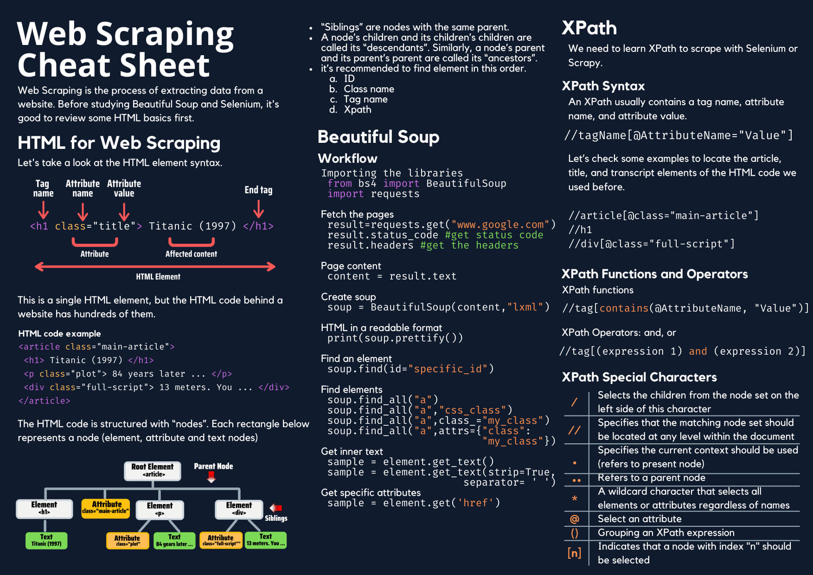

# Webscraping

la práctica de recopilar datos mediante un programa automatizado 
que consulta un servidor web.

<p align="center">
  
</p>


- [Webscraping](#webscraping)
  - [Webscraping Estático](#webscraping-estático)
    - [XPath](#xpath)
    - [BeautifulSoup](#beautifulsoup)
  - [find](#find)
  - [find\_all](#find_all)
  - [find\_next\_sibling](#find_next_sibling)
  - [find\_previous\_sibling](#find_previous_sibling)
  - [find\_parent](#find_parent)
  - [find\_all\_next](#find_all_next)
  - [select](#select)
  - [get\_text](#get_text)
  - [children](#children)
  - [parent](#parent)
  - [get](#get)
  - [attrs](#attrs)
  - [Webscraping Dinámico](#webscraping-dinámico)
    - [Selenium](#selenium)
  - [Examen](#examen)

## Webscraping Estático

### XPath

*Contenido sobre XPath.*

### BeautifulSoup

BeautifulSoup es una biblioteca de Python utilizada para analizar documentos HTML y XML. Permite a los desarrolladores navegar por la estructura del documento, buscar elementos específicos, y extraer datos con facilidad. Esta biblioteca es muy popular en el campo del web scraping debido a su simplicidad y eficacia.

## find
Encuentra el primer elemento que coincide con los criterios de búsqueda.
```python
first_paragraph = soup.find('p')
print(first_paragraph.get_text())
```

## find_all
Encuentra todos los elementos que coinciden con los criterios de búsqueda y devuelve una lista.
```python
all_paragraphs = soup.find_all('p')
for paragraph in all_paragraphs:
    print(paragraph.get_text())

html = """
<html>
<body>
<p class='content'>Hello, world!</p>
<p class='content'>Hello, again!</p>
</body>
</html>
"""
soup = BeautifulSoup(html, 'html.parser')
p_tags = soup.find_all('p', class_='content')
for p in p_tags:
    print(p.text)
```

## find_next_sibling
Encuentra el siguiente elemento hermano que coincide con los criterios de búsqueda.
```python
next_sibling = first_paragraph.find_next_sibling()
print(next_sibling.get_text())

html = "<html><body><p>First</p><p>Second</p></body></html>"
soup = BeautifulSoup(html, 'html.parser')
first_p = soup.find('p')
next_p = first_p.find_next_sibling('p')
print(next_p.text)  # Output: Second
```

## find_previous_sibling
Encuentra el elemento hermano anterior que coincide con los criterios de búsqueda.
```python
previous_sibling = next_sibling.find_previous_sibling()
print(previous_sibling.get_text())

```

## find_parent
Encuentra el elemento padre que coincide con los criterios de búsqueda.
```python
parent = first_paragraph.find_parent()
print(parent.name)
```

## find_all_next
Encuentra todos los siguientes elementos hermanos que coinciden con los criterios de búsqueda.
```python
all_next_siblings = first_paragraph.find_all_next('p')
for sibling in all_next_siblings:
    print(sibling.get_text())
```

## select
Utiliza selectores CSS para encontrar elementos.
```python
selected_elements = soup.select('body > p')
for element in selected_elements:
    print(element.get_text())
```

## get_text
Extrae el texto de un elemento y sus descendientes.
```python
text = first_paragraph.get_text()
print(text)
```
## children
Itera sobre los hijos directos del elemento actual.
```python
html = "<html><body><div><p>First</p><p>Second</p></div></body></html>"
soup = BeautifulSoup(html, 'html.parser')
div_tag = soup.find('div')
for child in div_tag.children:
    print(child.name)
```
## parent
Accede al elemento padre del elemento actual.
```python
html = "<html><body><div><p>Text</p></div></body></html>"
soup = BeautifulSoup(html, 'html.parser')
p_tag = soup.find('p')
div_tag = p_tag.parent
print(div_tag.name)  # Output: div
```
## get
Obtén el valor de un atributo específico de un elemento.
```python
html = "<html><body><a href='https://example.com'>Link</a></body></html>"
soup = BeautifulSoup(html, 'html.parser')
a_tag = soup.find('a')
href = a_tag.get('href')
print(href)  # Output: https://example.com
```

## attrs
Descripción: Accede a los atributos de un elemento.
```python
link = soup.find('a')
if link:
    print(link.attrs)
    print(link['href'])
```
## Webscraping Dinámico

### Selenium

[Enlace a Chrome Driver](https://googlechromelabs.github.io/chrome-for-testing/#stable)

## Examen

1.- Realice el Web scraping de la siguiente página usando selenium 
“https://subslikescript.com/” cree un dataframe (en *.csv) en donde extraiga las películas y sus correspondientes links. (6 puntos).

2.- Utilizando la misma página anterior realice la extracción del guion de una película (en *.csv o *.txt). (3 puntos).

3.- Realice el Web scraping de la siguiente página 
“https://en.wikipedia.org/wiki/%C3%8Dndice_de_Precio_Selectivo_de_Acciones” 
cree un dataframe (en *.csv) en donde extraiga la información de la tabla. (5 puntos)

4.- ¿En qué situaciones se hace necesario usar las sentencias try-except 
en Web Scraping? (2 puntos).

5.- ¿En qué situaciones se hace más cómodo utilizar Xpath en Web Scraping? (2 puntos).

6.- El Web Scraping dinámico presenta una serie de ventajas con respecto al Web Scraping estático, mencione 3 de esas ventajas. (2 puntos).